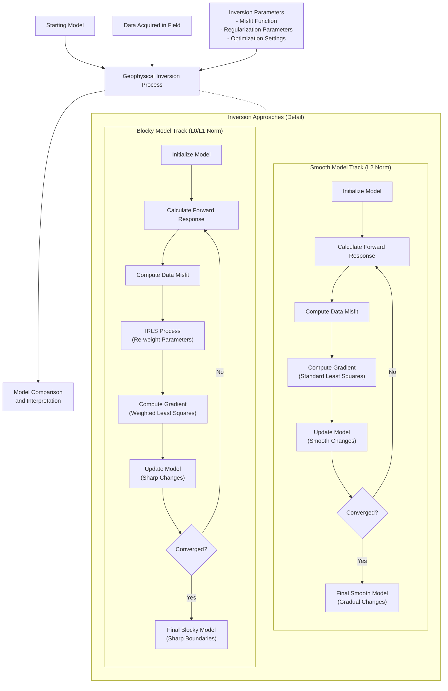

```mermaid
flowchart TD
    %% Data inputs
    StartModel["Starting Model"]
    FieldData["Data Acquired in Field"]
    InvParams["Inversion Parameters\n- Misfit Function\n- Regularization Parameters\n- Optimization Settings"]
    
    %% Main process node
    Process["Geophysical Inversion Process"]
    
    %% Output node
    Compare["Model Comparison\nand Interpretation"]
    
    %% Connect inputs to process
    StartModel --> Process
    FieldData --> Process
    InvParams --> Process
    
    %% Connect process to output
    Process --> Compare
    
    %% Create subgraph for model tracks as a detail of the process
    subgraph ModelTracks["Inversion Approaches (Detail)"]
        direction TB
        
        %% L2 Track
        subgraph SmoothTrack["Smooth Model Track (L2 Norm)"]
            direction TB
            L2Init["Initialize Model"]
            L2Calc["Calculate Forward Response"]
            L2Misfit["Compute Data Misfit"]
            L2Grad["Compute Gradient\n(Standard Least Squares)"]
            L2Update["Update Model\n(Smooth Changes)"]
            L2Conv{"Converged?"}
            
            L2Init --> L2Calc --> L2Misfit --> L2Grad --> L2Update --> L2Conv
            L2Conv -->|No| L2Calc
            L2Conv -->|Yes| L2Final
            L2Final["Final Smooth Model\n(Gradual Changes)"]
        end
        
        %% L0/L1 Track
        subgraph BlockyTrack["Blocky Model Track (L0/L1 Norm)"]
            direction TB
            L1Init["Initialize Model"]
            L1Calc["Calculate Forward Response"]
            L1Misfit["Compute Data Misfit"]
            L1IRLS["IRLS Process\n(Re-weight Parameters)"]
            L1Grad["Compute Gradient\n(Weighted Least Squares)"]
            L1Update["Update Model\n(Sharp Changes)"]
            L1Conv{"Converged?"}
            
            L1Init --> L1Calc --> L1Misfit --> L1IRLS --> L1Grad --> L1Update --> L1Conv
            L1Conv -->|No| L1Calc
            L1Conv -->|Yes| L1Final
            L1Final["Final Blocky Model\n(Sharp Boundaries)"]
        end
    end
    
    %% Connect process to model tracks with a dotted line to show it's a detail
    Process <-.- ModelTracks

```