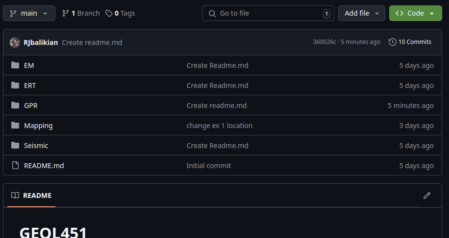
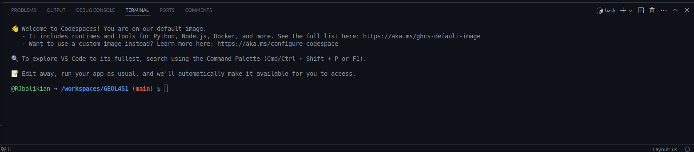

# Synthetic GPR models

For Exercise 3, you will need to run synthetic GPR models, observe the results, and respond to regarding these observations.

For synthetic GPR data, we will run gprMax, an open-source electromagnetic modeling software. The gprMax software can be difficult to set up, so this readme provides instructions for setting up gprMax in a Github codespace. Follow the instructions below to install and run gprMax.

# Setup gprMax for synthetic GPR modeling
1. Create a Github codespace from the Geol451 Repository
  a) Go to the main [GEOL451 github repository page](https://github.com/RJbalikian/GEOL451)
  b) There should be a (green) button near the top right of the main page that says "<> Code" 
  c) Click the Code button, navigate to the "Codespaces" tab, select the "+" button to create a codespace (remember, a codespace is essentially a virtual computer where you can run code on a Microsoft/Github system)
2. Use the Explorer tab (icon looks like two pages) on the left side of your browser window (or click Ctrl + Shift + E) 
  a) Your "Home" directory in this codespace will be "/workspaces/GEOL451/"
  b) Navigate to the GPR Folder in your codespace. You can continue to read these instructions are located in the Readme file at /workspaces/GEOL451/GPR/Readme.md
3. The lower half of your page should by default have a bash terminal window. There are multiple "tabs" on the top of this section should have multiple views. Select the "Terminal" view. At the right side of this window section is a "plus" button and chevron (down arrow). It should say bash next to that, and your terminal should have your username and your current directory and the branch name in parantheses. For me, this looks like: `@RJbalikian ➜ /workspaces/GEOL451 (main) $`. Your cursor should be after the $.
  
4. We will install gprMax and work with it from here. In the terminal, change your directory to the GPRMax directory using the follow command: `cd GPR/SyntheticGPR/GPRMax`
5. We will install gprMax into this folder using anaconda (this should already be installed on your codespace). The instructions for this are included here, but you may also see more information at the gprMax documentation [here](https://docs.gprmax.com/en/latest/include_readme.html#installation). You may have to type "y" when the system prompts to confirm that you want to install/download based on these commands. Usually, you have to right click and select paste if you are copy/pasting these commands (Ctrl + v may not work)
  i) Your terminal should now say: `@<YOUR_USERNAME> ➜ .../GEOL451/GPR/SyntheticGPR/GPRMax (main) $`. 
  ii) Add the conda-forge channel to anaconda: `conda config --append channels conda-forge`
  iii) Update anaconda: `conda update conda`
  iv) Install git (to be able to copy code to your codespace): `conda install git`
  v) Clone/copy the gprMax repository into your GPRMax folder: `git clone https://github.com/gprMax/gprMax.git`
  vi) Change your working directory into your new gprMax folder: `cd gprMax`
  vii) Create a new anaconda environment with all the dependencies needed to run gprMax: `conda env create -f conda_env.yml`
  viii) Restart anaconda to register new environment: `conda init`
  ix) KILL YOUR TERMINAL (click the trash can icon/kill terminal button near the top right of the lower/terminal window)
  x) REOPEN YOUR TERMINAL. The easiest way is Ctrl + tilda (usually, the button next to the 1 at the top left of your keyboard)
    a) Reset your working directory to the gprMax folder: `cd GPR/SyntheticGPR/GPRMax/gprMax`
  xi) Activate the gprMax anaconda environment: `conda activate gprMax`
    a) You should notice the environment name at the far left of your terminal `(gprMax)`
  xii) Build the gprMax software package: `python setup.py build`
  xiii) Install the gprMax software package: `python setup.py install`

To repeat and display in a more compact form, these commands are:
```bash
cd GPR/SyntheticGPR/GPRMax
conda config --append channels conda-forge
conda update conda
conda install git
git clone https://github.com/gprMax/gprMax.git
cd gprMax
conda env create -f conda_env.yml
conda init
# KILL YOUR TERMINAL
# REOPEN THE TERMINAL
cd GPR/SyntheticGPR/GPRMax/gprMax
conda activate gprMax
python setup.py build
python setup.py install
```

# Run gprMax
